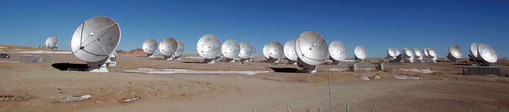
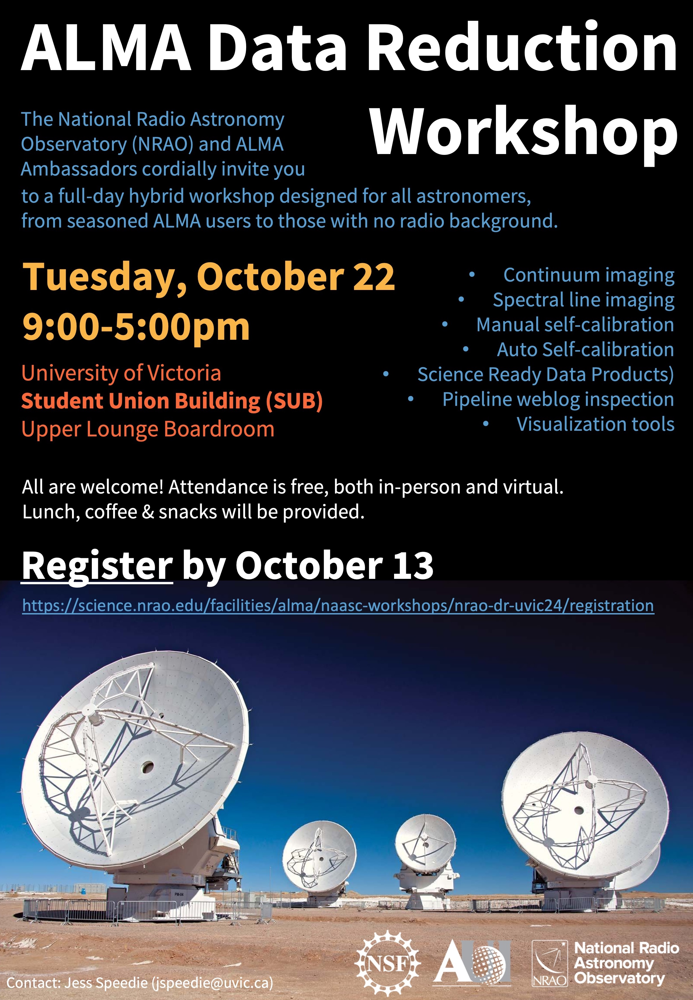

# ALMA Data Reduction Workshop at the University of Victoria

<!-- <button style="
      background-color: white;
      border: 2px solid #4682b4;
      border-radius: 12px;
      color: black;
      padding: 10px 20px;
      font-size: 16px;
      cursor: pointer;
      transition: background-color 0.3s ease;
      "
      onmouseover="this.style.backgroundColor='#e1f2fc';"
      onmouseout="this.style.backgroundColor='white';">
**Register here**
</button> -->



<a></a>

* **Registration:** <a href="https://science.nrao.edu/facilities/alma/naasc-workshops/nrao-dr-uvic24/registration" target="_blank">https://science.nrao.edu/facilities/alma/naasc-workshops/nrao-dr-uvic24/registration</a>

* **Date:** Tuesday October 22, 2024

* **Time:** 9:00-5:00pm (coffee served at 8:30am)

* **Location:** Upper Lounge Boardroom, <a href="https://uvss.ca/thesub/" target="_blank">Student Union Building (SUB)</a>, University of Victoria (map below)

* **Zoom:** <a href="https://science.nrao.edu/facilities/alma/naasc-workshops/nrao-dr-uvic24/registration" target="_blank">Register</a> for Zoom link

The National Radio Astronomy Observatory (NRAO) and ALMA Ambassadors cordially invite you to an ALMA Data Processing Workshop. This event is designed for all astronomers, from seasoned ALMA users to those who do not regularly utilize radio data in their research or have no radio background. We encourage participation from graduate students and junior postdocs, but we welcome astronomers at all levels of experience. The workshop will provide an overview of ALMA interferometric data processing and analysis, including: imaging and self-calibration with CASA, imaging array combinations, and data visualization with CARTA.

Registration is free and this is a hybrid event. Attendance is equally welcome in-person or virtually. We'd greatly appreciate it if you could sign up before October 13 so that we have an accurate count for lunches. Note that lunches will only be provided for in-person participants.

```{tableofcontents}
```

## Location

Upper Lounge Boardroom, Student Union Building (SUB), University of Victoria.

<iframe src="https://www.google.com/maps/embed?pb=!1m14!1m8!1m3!1d3052.0385028059636!2d-123.308168!3d48.464984!3m2!1i1024!2i768!4f13.1!3m3!1m2!1s0x548f7150a5d71e35%3A0x5ff07ab0cf6cf84a!2sStudent%20Union%20Bldg%2C%203800%20Finnerty%20Rd%2C%20Victoria%2C%20BC%20V8P%205C2%2C%20Canada!5e1!3m2!1sen!2sus!4v1728348530820!5m2!1sen!2sus" width="600" height="450" style="border:0;" allowfullscreen="" loading="lazy" referrerpolicy="no-referrer-when-downgrade"></iframe>


## Poster



<!-- Zoom room can be by home institute or NRAO zoom link. -->

<!-- Directory where speakers are uploading their slide decks: https://astrocloud.nrao.edu/s/zBa2Abb5Sc33D92 -->
